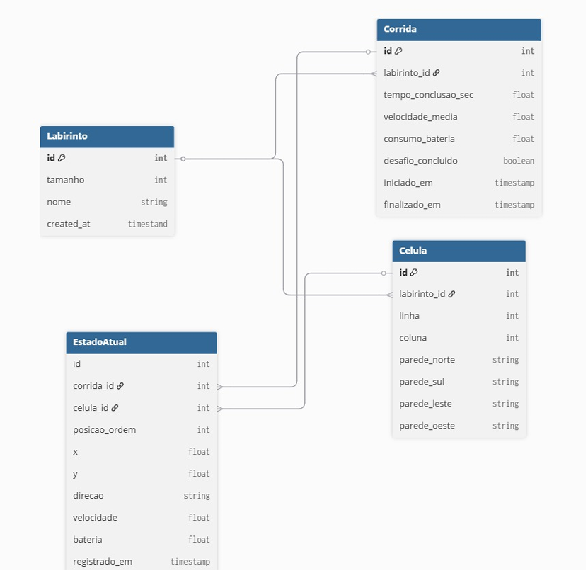

# Arquitetura de Software

## 1. Introdução

### 1.1 Visão Geral

Este documento descreve a arquitetura de software do sistema **MicroMouse RataTuring**, apresentando as principais decisões arquiteturais por meio das visões lógica, de processos, de implantação e de dados. Destina-se a desenvolvedores e demais partes interessadas no projeto.

### 1.2 Propósito

O propósito do software do RataTuring é prover a lógica computacional necessária para o veículo navegar de forma autônoma por um labirinto desconhecido, processando variáveis do ambiente e controlando sua locomoção. Integrado a isso, o sistema gerencia o envio contínuo de telemetria para um servidor web, permitindo o monitoramento da operação. Estão fora de escopo deste documento o projeto mecânico e o roteamento de hardware.

---

## 2. Representação Arquitetural

### 2.1 Papel do Software no Sistema

Osoftware atua como o núcleo de controle do Micromouse. No ambiente físico, ele opera de forma isolada, sendo responsável pela percepção e tomada de decisão autônoma. Externamente, interage com os operadores da equipe, fornecendo dados estruturados no painel de monitoramento para análise de desempenho.

### 2.2 Padrão Adotado

**Padrão:** Arquitetura em Camadas e MVT.

**Justificativa:**
A divisão em camadas no microcontrolador permite separar os algoritmos de navegação das rotinas de controle físico, facilitando a manutenção e os testes. No painel web, o padrão MVT agiliza o desenvolvimento ao unificar de forma estruturada a interface de visualização, a recepção de dados e a persistência no banco de dados.

## 3. Metas e Restrições da Arquitetura

### 3.1 Objetivos Arquiteturais

A arquitetura deve garantir estabilidade em tempo real (para a precisão do controle de movimento) e modularidade.

### 3.2 Restrições

As principais restrições englobam a limitação de capacidade de processamento do microcontrolador e a necessidade de garantir que o envio de dados via rede sem fio não interrompa as rotinas críticas de leitura de sensores e atuação nos motores.

---

## 4. Visão Lógica
### 4.1 Diagrama de Alto Nível
O software do sistema RataTuring adota um banco de dados relacional SQLite para a primeira versão. A escolha relacional se justifica pela necessidade de referenciar corridas, labirintos, células e registros do estado atual entre si, facilitando consultas analíticas e comparando resultados de corridas.

### 4.2 Divisão em Camadas

**- Camada de Abstração de Hardware (HAL):** Interface direta com os componentes eletrônicos, responsável pela leitura bruta dos sensores e acionamento dos motores. 

**- Camada de Filtros:** Processamento dos sinais físicos para mitigar ruídos e converter leituras em distâncias métricas confiáveis.   

**- Camada de Navegação e Controle:** Núcleo de inteligência que abriga a matriz do labirinto e a malha de controle PID.    

**- Camada de Comunicação:** Responsável por formatar os dados de estado do robô e gerenciar a transmissão via rede sem fio.
### 4.3 Tecnologias

#### Linguagens de Programação

| Módulo | Tecnologia | Justificativa |
|-----------------|-----------|---------------|
|Embarcado | C/C++ | Alto desempenho computacional e eficiência no gerenciamento de memória. |
|Back-end | Python (Django) | Escalabilidade, produtividade e suporte nativo ao gerenciamento de dados relacionais. |
|Front-end | HTML, CSS, JS | Construção de interfaces dinâmicas para renderização do labirinto no navegador. |
|Banco de Dados | SQLite | Banco de dados relacional leve, sem necessidade de servidor dedicado, adequado para armazenamento local da telemetria. |

#### Frameworks Utilizados

| Módulo / Categoria | Tecnologia | Finalidade |
|-----------|---------------------|------------|
| Front-end (Visual) | CSS / Tailwind | Renderização rápida e estruturação visual do mapa e painéis no navegador. |
| Front-end (Rede) | WebSocket API | Conexão contínua com o servidor para atualizações em tempo real. |
| Back-end (Web) | Django 5.x | Servidor principal, gerenciamento de fluxo de dados e integração com banco. |
| Back-end (Rede assíncrona) | Django Channels | Suporte a conexões simultâneas para processar a telemetria contínua. |

## 5. Visão de Processos
O fluxo de controle do robô opera de forma cíclica e concorrente:

**1. Aquisição:** O sistema realiza a varredura contínua dos sensores de distância e codificadores (encoders).

**2. Processamento Lógico:** Os dados são filtrados e repassados ao algoritmo de inteligência, que mapeia as paredes e determina a direção da próxima célula.

**3. Atuação:** A diferença entre a posição real e a desejada alimenta o controlador PID, que ajusta a potência enviada aos motores.

**4. Comunicação Assíncrona:** A diferença entre a posição real e a desejada alimenta o controlador PID, que ajusta a potência enviada aos motores.

## 6. Visão de Implantação

A infraestrutura do sistema é distribuída em três frentes principais:

### 6.1 Nós de Implantação

| Nó / Ambiente | Componentes hospedados | Comunicação / Rede |
|---------------|----------------------|-------------------|
| Microcontrolador | Firmware do Veículo Autônomo | Comunicação / Rede |
| Servidor Web | Back-end Django e Banco de Dados | TCP/IP e WebSockets |
| Máquina do Operador| Interface Gráfica (Navegador)| HTTP/HTTPS |

## 7. Visão de Dados
### 7.1 Modelo de Dados

#### Diagrama Entidade-Relacionamento (DER)

<figure style="text-align: center; margin: 20px 0;">
    
</figure>

### 7.2 Entidades Principais

| Entidade | Descrição | Relacionamentos |
|----------|-----------|-----------------|
| Labirinto | Representa um labirinto com tamanho padrão (4, 8 ou 16), sem alteração de schema. | Um Labirinto agrupa múltiplas Corridas e Células (1:N). |
| Célula | Cada célula armazena o estado de suas 4 paredes( livre, parede ou desconhecido), permitindo mapeamento incremental. Existe independentemente da corrida. | Cada Célula pertence a um Labirinto (N:1) e pode ser referenciada por múltiplos registros de EstadoAtual. |
| Corrida | Registra dados agregados e finais: tempo total, velocidade média e bateria, calculados ao final da partida. | Uma Corrida pertence a um Labirinto (N:1) e agrupa múltiplos registros de EstadoAtual (1:N) |
| EstadoAtual | Registra cada ponto instantâneo de posição do robô ao longo da corrida, capturado a cada célula visitada. Os campos **velocidade_cms** e **bateria_v** representam valores no momento exato da visita. O campo **posicao_ordem** garante a reconstituição do trajeto a reconstituição do trajeto na ordem correta. | Cada registro pertence a uma Corrida (N:1) e referencia uma Célula (N:1). |
