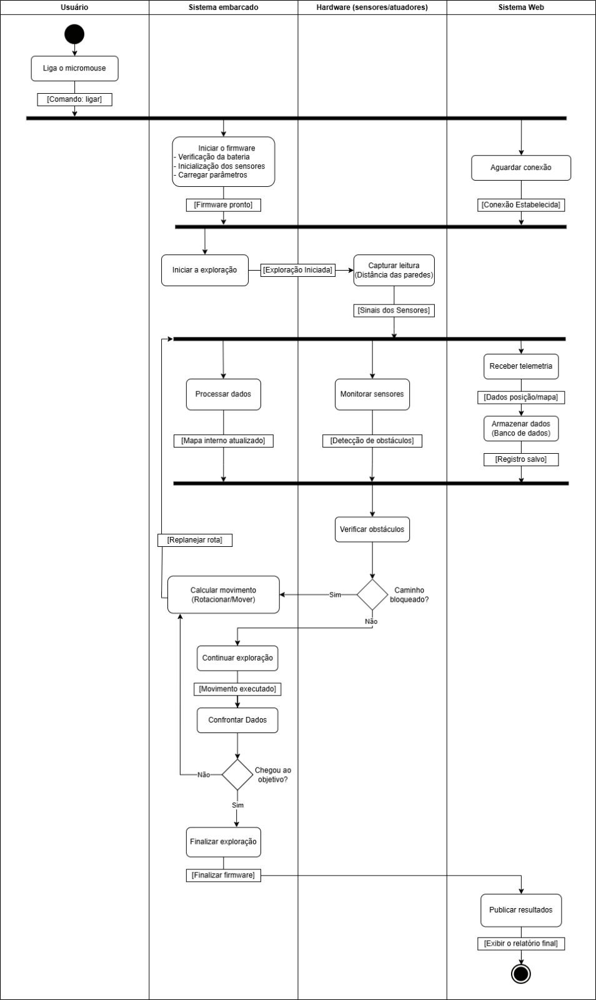

# Diagrama de atividades UML
## 1. Contexto
O **Diagrama de atividades** é um diagrama comportamental da UML utilizado para **modelar o fluxo de um sistema**, descrevendo a sequência de atividades executadas, os pontos de decisão, os fluxos paralelos e a troca de dados entre os participantes. No contexto do projeto, o diagrama permite visualizar como o Micromouse opera desde sua inicialização até a publicação dos resultados. As swimlanes (Usuário, Sistema Embarcado, Hardware e Sistema Web) identificam claramente em quais domínios cada atividade é executada.
### 1. Diagrama
<figure style="text-align: center; margin: 20px 0;">
    
</figure>

## 2. Detalhamento
**1. Usuário:** ator humano responsável pelo gatilho inicial.

**2. Sistema Embarcado:** núcleo lógico de controle e processamento.

**3. Hardware (Sensores/Atuadores):** interface física com o labirinto.

**4. Sistema Web:** interface externa de monitoramento e armazenamento.

### 2.1 Fluxo de Comportamento
**A. Inicialização e paralelismo (bifurcação):** O usuário liga o Micromouse; o sinal [Comando:
ligar] dispara duas frentes paralelas — inicialização do firmware no sistema embarcado e
aguardo de conexão no sistema web. Uma barra de sincronização garante que a exploração
só inicie após ambos estarem prontos.

**B. Exploração e monitoramento:** O hardware captura leituras dos sensores, que alimentam
três processos simultâneos: atualização do mapa interno (embarcado), monitoramento de
obstáculos (hardware) e recepção e armazenamento de telemetria (sistema web).

**C. Tomada de decisão e controle (Nós de Decisão):** o dinamismo do sistema é definido por
dois pontos críticos de decisão:

**Verificação de obstáculos:** o sistema questiona "Caminho bloqueado?".

**Sim:** aciona o cálculo de movimento (rotação/desvio) e retorna ao replanejamento de rota.

**Não:** segue para a atividade de "Continuar exploração".

**Verificação de objetivo:** após o movimento e o confronto de dados, o sistema questiona:
"Chegou ao objetivo?".

**Sim:** direciona para o encerramento.

**Não:** o fluxo retorna ao ponto de processamento de dados para continuar a busca.

**D. Finalização e saída ao atingir o objetivo:**

1. O sistema embarcado executa a atividade "Finalizar exploração".

2. O sinal [Finalizar firmware] é enviado ao sistema web.

**Resultado final:** o sistema web executa a atividade "Publicar resultados", gerando o [Relatório
final]. O fluxo encerra no estado final (círculo com borda).

## 3. Tabela de Insumos
| Atividade | Insumos (Entradas) | Saídas |
| :--- | :--- | :--- |
| Ligar o micromouse | Ação do usuário | [Comando: ligar] |
| Iniciar o firmware | [Comando: ligar], bateria, sensores, parâmetros do sistema | [Firmware pronto] |
| Aguardar conexão | [Comando: ligar], Inicialização do sistema web | [Conexão Estabelecida] |
| Iniciar a exploração | [Firmware pronto] e [Conexão Estabelecida] | [Exploração iniciada] |
| Capturar leitura | [Exploração iniciada], leituras dos sensores, distância das paredes | [Sinais dos Sensores] |
| Processar dados | [Sinais dos Sensores], mapa interno anterior | [Mapa interno atualizado] |
| Monitorar sensores | [Sinais dos Sensores] | [Detecção de obstáculos] |
| Receber telemetria | [Sinais dos Sensores], dados enviados pelo sistema embarcado | [Dados posição/mapa] |
| Armazenar dados | [Dados posição/mapa] | [Registro salvo] |
| Verificar obstáculos | [Mapa interno atualizado]; [Detecção de obstáculos] e [Registro salvo] | Decisão: caminho bloqueado ou livre |
| Calcular movimento (Rotacionar/Mover) | Decisão: caminho bloqueado ou objetivo não alcançado | [Replanejar rota] |
| Continuar exploração | Decisão: caminho livre | [Movimento executado] |
| Confrontar dados | [Movimento executado], mapa interno atualizado | Decisão: verificação do objetivo |
| Finalizar exploração | Decisão: objetivo alcançado | [Finalizar firmware] |
| Publicar resultados | [Finalizar firmware] | [Exibir o relatório final] |